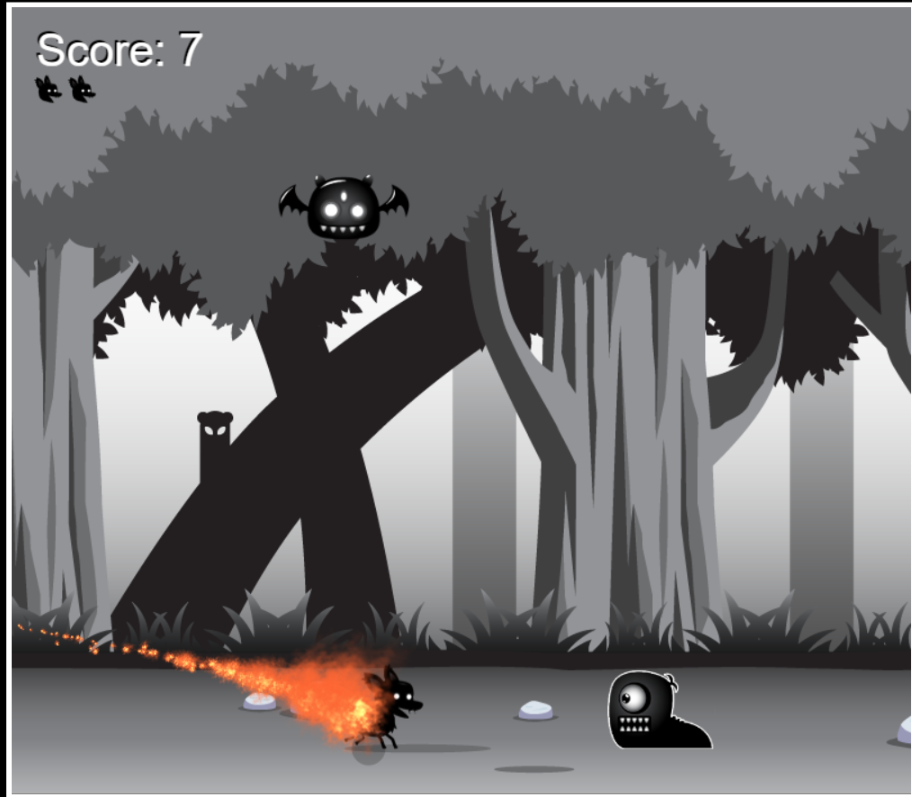

# Friendly-dog

Deploy: https://friendly-dog.netlify.app/

#
##Description

This is game shows the basics principles drawing animations using images ans Canvas.
Also it is a great example of using OOP and Design Patterns.

##### Moving: Arrow keys
##### Switch on attack mode: CTRL

#### `npm run instal`
#### `npm start`

Open [http://localhost:8000](http://localhost:3000) to view it in the browser.

The page will reload if you make edits.

